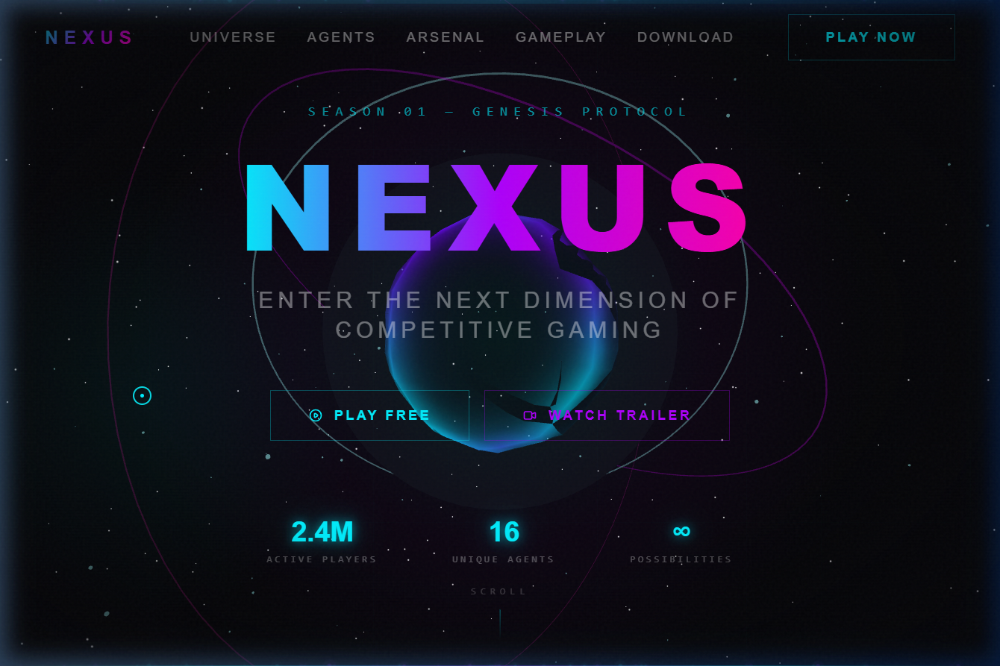
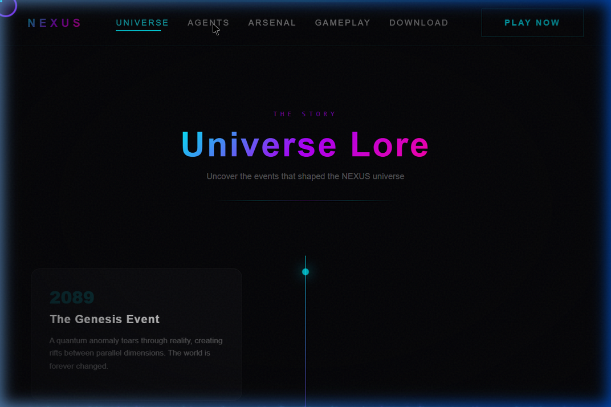
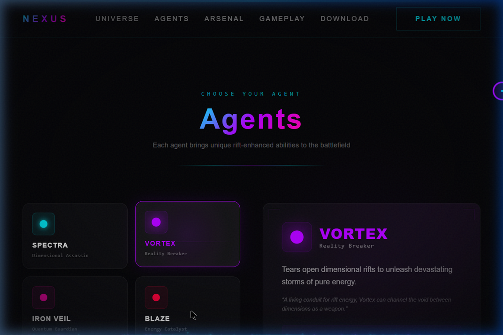
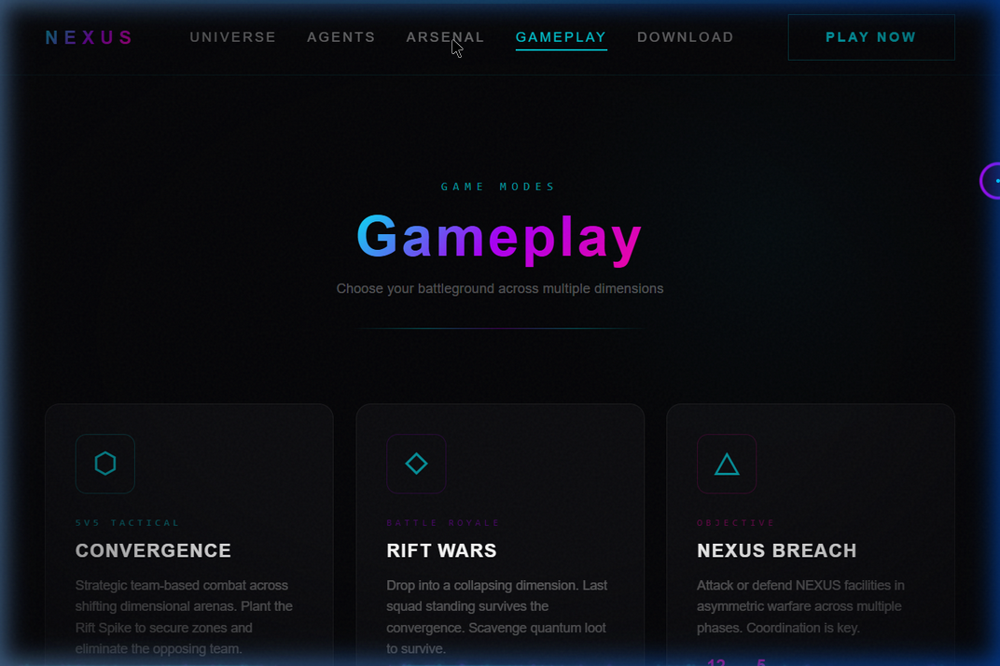
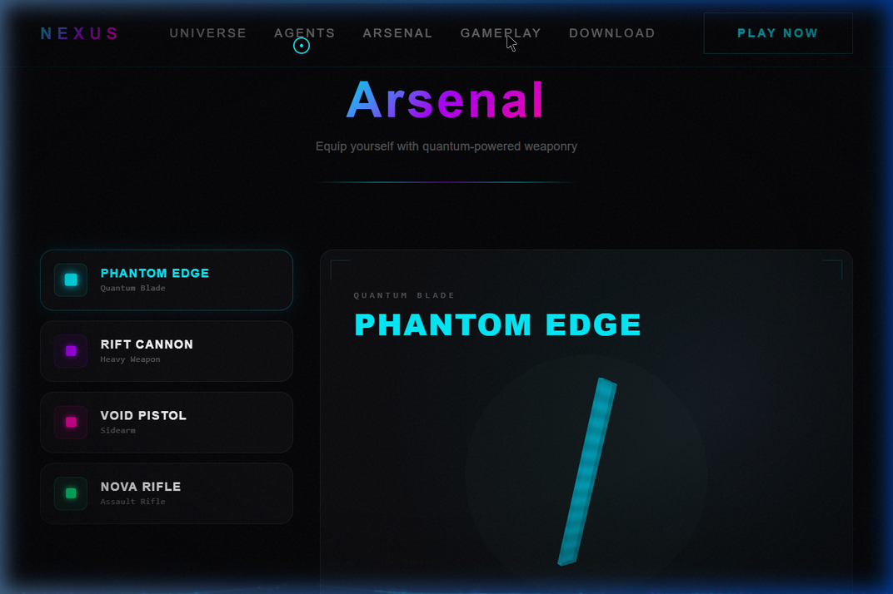
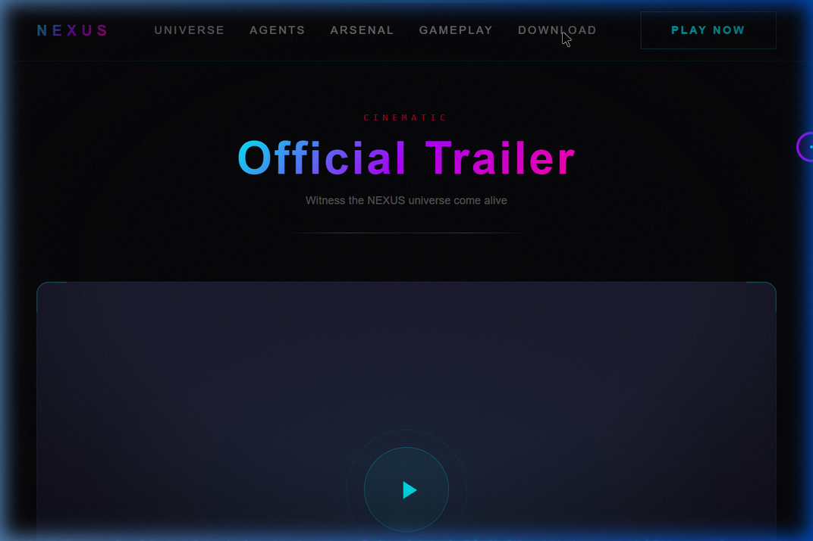
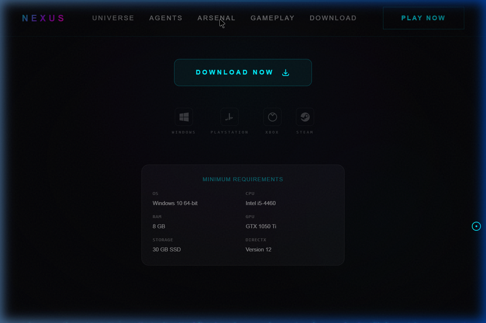

<p align="center">
  
  
  
  
  
  
</p>

<h1 align="center">🎮 NEXUS — Enter the Game Universe</h1>

<p align="center">
  <strong>A cinematic AAA-quality futuristic gaming website built with cutting-edge web technologies.</strong><br/>
  Featuring immersive 3D environments, real-time WebGL shaders, cinematic scroll animations, and a cyberpunk UI aesthetic.<br/><br/>
  <strong>Website game tương lai chất lượng AAA với công nghệ web tiên tiến.</strong><br/>
  Môi trường 3D sống động, shader WebGL thời gian thực, animation cuộn cinematic, và giao diện cyberpunk.
</p>

<p align="center">
  <a href="#-overview--tổng-quan">Overview</a> •
  <a href="#-screenshots">Screenshots</a> •
  <a href="#%EF%B8%8F-tech-stack--công-nghệ">Tech Stack</a> •
  <a href="#-getting-started--bắt-đầu">Getting Started</a> •
  <a href="#-project-structure--cấu-trúc-dự-án">Structure</a> •
  <a href="#-architecture--kiến-trúc">Architecture</a>
</p>

---

## 🌟 Overview / Tổng Quan

**NEXUS** is a production-quality AAA gaming website with a **Cyberpunk / Sci-Fi** aesthetic, inspired by titles like Cyberpunk 2077, Valorant, Destiny 2 and Unreal Engine showcases.

**NEXUS** là website game chất lượng AAA phong cách **Cyberpunk / Sci-Fi**, lấy cảm hứng từ Cyberpunk 2077, Valorant, Destiny 2 và các showcase Unreal Engine.

- 🎬 **Cinematic** — Every section is a cinematic experience / Mỗi section là trải nghiệm điện ảnh
- 🌐 **3D Immersive** — Real-time interactive 3D environments / Môi trường 3D tương tác thời gian thực
- ⚡ **Smooth 60 FPS** — GPU-optimized smooth animations / Animation mượt mà, tối ưu GPU
- 🎨 **Premium UI** — Glassmorphism, neon glow, holographic effects
- 📱 **Responsive** — Full desktop & mobile support / Hỗ trợ đầy đủ desktop & mobile

---

## 📸 Screenshots

### 🎯 Hero Section — Energy Core 3D

> **EN:** Main screen featuring a **3D Energy Core** (GLSL-shaded icosahedron), **Orbital Rings** rotating at multiple speeds, **Floating Particles**, and a **shimmer gradient NEXUS** title. Dark cyberpunk background with vignette edge effect.
>
> **VI:** Màn hình chính với **3D Energy Core** (khối đa diện GLSL shader), hệ thống **Orbital Rings** quay đa tốc, hạt nổi **Floating Particles**, và tiêu đề **shimmer gradient NEXUS**. Nền tối cyberpunk với hiệu ứng vignette viền.



**Key Features / Tính năng nổi bật:**
- 🔮 3D icosahedron with **GLSL vertex displacement shader** — sinusoidal surface breathing effect
- 🌀 3 Orbital Rings rotating at different speeds and axes (cyan, purple, pink)
- ✨ 150 Floating Particles (InstancedMesh) with sinusoidal 3D movement
- 💡 **Mouse-reactive lighting** — PointLight follows cursor position
- 🌌 Background Stars with fade and depth effects
- 📊 Realtime stats: **2.4M Active Players** | **16 Unique Agents** | **∞ Possibilities**
- 🖱️ Custom neon cursor with hover effects on interactive elements

---

### 📜 Story Section — Universe Lore Timeline

> **EN:** NEXUS Universe storyline timeline from **2089** to **2097**, each event displayed on glassmorphism cards with cinematic GSAP scroll effects.
>
> **VI:** Timeline cốt truyện NEXUS Universe từ năm **2089** đến **2097**, mỗi sự kiện hiển thị trên thẻ glassmorphism với hiệu ứng cuộn GSAP cinematic.



**Key Features / Tính năng nổi bật:**
- 📅 Vertical timeline with neon gradient line (blue → purple → pink)
- 💫 Milestone dots with pulse glow animation in matching colors
- 🃏 Glassmorphism cards with **GSAP ScrollTrigger scrub** — smooth card reveal on scroll
- 📐 Alternating left-right layout on desktop, unified left on mobile
- ✨ Holographic underline appears on card hover
- 🎭 4 major events: The Genesis Event → Project NEXUS → The Agent Program → The Convergence

---

### 🦸 Character Section — Agent Showcase

> **EN:** Interactive agent selection area with 4 characters. Click cards to view details, animated stat bars, lore text and signature abilities.
>
> **VI:** Khu vực chọn Agent với 4 nhân vật tương tác. Click vào card để xem chi tiết, thanh stats animate, lore text và khả năng đặc biệt.



**Key Features / Tính năng nổi bật:**
- 🎴 4 interactive Agent cards: **SPECTRA** (Cyan) | **VORTEX** (Purple) | **IRON VEIL** (Pink) | **BLAZE** (Red)
- 🔄 **AnimatePresence** transition — smooth slide animation when switching agents
- 📊 **Animated stat bars** — Attack, Defense, Speed, Ability with gradient fill
- 💡 **Dynamic background glow** — background color changes with selected agent
- 🔍 Scan-line effect running across active card
- 📖 Lore text with character history quotes
- 🏷️ HUD corner decorations (game interface style)
- 💎 Signature Ability displayed in dedicated frame

---

### ⚔️ Gameplay Section — Game Modes

> **EN:** 3 main NEXUS game modes, each displayed on its own card with rotating icon on hover and player/map stats.
>
> **VI:** 3 chế độ chơi chính của NEXUS, mỗi mode hiển thị trên thẻ riêng với icon xoay khi hover và thông số players/maps.



**Key Features / Tính năng nổi bật:**
- 🎮 3 Game Modes: **CONVERGENCE** (5v5 Tactical) | **RIFT WARS** (Battle Royale) | **NEXUS BREACH** (Objective)
- ♻️ Icon rotates 90° on hover with scale animation
- 🌊 Scan-line effect sweeps through card on hover
- 📊 Per-mode stats: player count and map count
- 🎨 Gradient underline expand animation from 0% → 100%
- 🔮 GSAP ScrollTrigger with **rotateY 3D reveal** — cards appear as if turning from the side

---

### 🔫 Weapons Section — Arsenal & 3D Viewer

> **EN:** NEXUS weapon armory with 4 weapons, each featuring a **real-time 3D model viewer** with scan-line shader effects.
>
> **VI:** Kho vũ khí NEXUS với 4 vũ khí, mỗi vũ khí có **3D model viewer** thời gian thực với shader scan-line.



**Key Features / Tính năng nổi bật:**
- 🗡️ 4 Weapons: **PHANTOM EDGE** (Quantum Blade) | **RIFT CANNON** (Heavy) | **VOID PISTOL** (Sidearm) | **NOVA RIFLE** (Assault)
- 🎨 **Real-time 3D Weapon Viewer** with React Three Fiber
  - Unique geometry per weapon (blade, cylinder, box)
  - **GLSL procedural shader** with fresnel rim glow + scan-line overlay
  - Auto-rotation 360° + Float bobbing
- 📊 Stats grid with **animated fill bars** at bottom of each cell (Damage, Range, Speed)
- 🎯 HUD frame corners (military interface style)
- 🌟 Energy orb pulse animation on selected weapon
- 🎬 GSAP staggered list reveal from left

---

### 🎬 Trailer Section — Cinematic Player

> **EN:** Official trailer area with cinematic play button, energy ring animations and video quality info.
>
> **VI:** Khu vực trailer chính thức với nút play cinematic, energy rings animation và thông tin chất lượng video.



**Key Features / Tính năng nổi bật:**
- ▶️ Play button with **double pulse ring** animation (expand + fade)
- 🌀 Dual energy rings rotating in opposite directions behind the play button
- 🎬 GSAP ScrollTrigger **scale reveal** — video container scales up when scrolling into view
- 🏷️ Corner accent decorations (cinematic frame style)
- 📺 Quality info: **4K Ultra HD** | **Dolby Atmos** | **HDR10+**
- 🔲 Grid overlay pattern with low opacity for depth

---

### ⬇️ Download Section — CTA & Platforms

> **EN:** Game download area with large CTA button, 4 platform icons and minimum system requirements.
>
> **VI:** Khu vực tải game với nút CTA lớn, biểu tượng 4 nền tảng và bảng cấu hình tối thiểu.



**Key Features / Tính năng nổi bật:**
- ✨ **Shimmer gradient text** "Enter the NEXUS" with continuous sweep animation
- 🔘 CTA button with **sweep light effect** + dual pulse border rings
- 🖥️ 4 Platform SVG icons: **Windows** | **PlayStation** | **Xbox** | **Steam**
  - Hover effect: lift up (-3px) + neon border glow
- 📋 **System Requirements** glassmorphism card: OS, CPU, RAM, GPU, Storage, DirectX
- 🌟 Background pulsing radial gradient (breathing effect)
- 🎬 GSAP scroll-triggered title reveal with scale + opacity

---

## 🛠 Overlay Systems & Effects / Hệ Thống Overlays

| System | Description / Mô tả |
|---|---|
| 🖱️ **Custom Cursor** | Neon ring + dot following mouse, 2x scale on hover interactive elements |
| 🔄 **Loading Screen** | NEXUS gradient logo + progress bar + grid background, auto-hide at 100% |
| ✨ **Particle Field** | Canvas particle system with mouse repulsion + connection lines between nearby particles |
| 📺 **Scan Line** | CRT-style sweep line moving continuously from top to bottom |
| 🎞️ **Noise Overlay** | SVG film grain texture for cinematic feel |
| 🌑 **Vignette** | Radial gradient darkening at screen edges |
| 🧭 **Navbar** | Fixed, backdrop-blur on scroll, animated mobile hamburger menu |
| 🌊 **Smooth Scroll** | Lenis engine for buttery smooth scrolling experience |

---

## 🏗️ Tech Stack / Công Nghệ

| Technology | Role / Vai trò |
|---|---|
| **Next.js 14** | App Router, SSR framework |
| **React 18** | UI Components |
| **TypeScript** | Type safety |
| **TailwindCSS 3.4** | Utility-first CSS styling |
| **Three.js** | 3D rendering engine |
| **React Three Fiber** | React renderer for Three.js |
| **@react-three/drei** | Helpers (Float, Stars) |
| **GSAP + ScrollTrigger** | Scroll-based cinematic animations |
| **Framer Motion** | Component transitions & micro-interactions |
| **Lenis** | Smooth scroll engine |
| **Zustand** | State management |
| **GLSL** | Custom vertex & fragment shaders |

---

## 🚀 Getting Started / Bắt Đầu

### Prerequisites / Yêu cầu

- **Node.js** ≥ 18.0
- **npm** ≥ 9.0

### Installation / Cài đặt

```bash
# Clone repo
git clone https://github.com/ankhangbc2021-oss/NEXUS-.git
cd NEXUS-

# Install dependencies / Cài đặt thư viện
npm install

# Start development server / Chạy server phát triển
npm run dev
```

Open browser at / Mở trình duyệt tại **http://localhost:3000**

### Build Production

```bash
npm run build
npm start
```

---

## 📁 Project Structure / Cấu Trúc Dự Án

```
NEXUS-/
├── 📄 CLAUDE.md                 # Project documentation & changelog
├── 📄 MASTER_PROMPT.md          # Design specification
├── 📄 next.config.mjs           # Next.js config
├── 📄 tailwind.config.ts        # TailwindCSS theme (neon colors, animations)
├── 📄 tsconfig.json             # TypeScript config
├── 📄 package.json              # Dependencies
│
├── 📂 docs/screenshots/         # README screenshots
│
└── 📂 src/
    ├── 📂 app/
    │   ├── globals.css           # Global styles, CSS vars, overlays
    │   ├── layout.tsx            # Root layout + SEO metadata
    │   └── page.tsx              # Main page (SmoothScroll + GSAP)
    │
    └── 📂 components/
        ├── 📂 features/          # 9 page sections
        │   ├── HeroSection.tsx
        │   ├── StorySection.tsx
        │   ├── CharacterSection.tsx
        │   ├── GameplaySection.tsx
        │   ├── WeaponsSection.tsx
        │   ├── MultiplayerSection.tsx
        │   ├── TrailerSection.tsx
        │   ├── DownloadSection.tsx
        │   └── Footer.tsx
        │
        ├── 📂 scenes/            # 3D Three.js scenes
        │   ├── HeroScene.tsx     # Energy Core + Rings + Particles
        │   └── WeaponViewer.tsx  # Procedural weapon models
        │
        ├── 📂 systems/           # Global systems
        │   ├── ParticleField.tsx
        │   └── SmoothScroll.tsx
        │
        └── 📂 ui/                # Shared UI components
            ├── CustomCursor.tsx
            ├── LoadingScreen.tsx
            └── Navbar.tsx
```

---

## 🏛 Architecture / Kiến Trúc

### Animation Pipeline

```
GSAP ScrollTrigger (scroll-based)
  ├── Hero parallax (scrub)
  ├── Section reveals (staggered)
  └── 3D perspective entrances

Framer Motion (component-level)
  ├── AnimatePresence transitions
  ├── whileHover / whileTap
  ├── Infinite pulse loops
  └── InView triggered animations

CSS Keyframes (ambient)
  ├── Shimmer text gradient sweep
  ├── Glow pulse / float
  ├── Scan line movement
  └── Energy flow gradients
```

### 3D Shader Pipeline

```
GLSL Vertex Shader
  └── Sinusoidal normal displacement → Breathing surface animation

GLSL Fragment Shader
  ├── Fresnel rim detection
  ├── Dual-color time-based mixing
  ├── Scan-line overlay
  └── Pulsing alpha modulation
```

### Rendering Strategy

```
Canvas (R3F)           │  DOM (React)
───────────────────────│──────────────────────
Energy Core (shader)   │  Navbar (fixed)
Orbital Rings          │  Section content
Floating Particles     │  Glass cards
Weapon Models          │  Stats & buttons
Stars                  │  Overlays (scan, vignette)
Mouse Light            │  Custom cursor
                       │  Particle Field (2D canvas)
```

---

## ⚡ Performance / Hiệu Năng

| Optimization | Description / Mô tả |
|---|---|
| **Dynamic imports** | Lazy load 3D scenes, cursor, particles |
| **Canvas DPR 1.5** | Balance quality/performance / Cân bằng chất lượng-hiệu năng |
| **InstancedMesh** | 150 particles in 1 draw call (not 150) |
| **GPU acceleration** | `powerPreference: 'high-performance'` |
| **Mobile fallback** | Reduced particles, disabled custom cursor |
| **GSAP cleanup** | `ctx.revert()` prevents memory leaks |
| **Lazy ScrollTrigger** | Only activates when element enters viewport |

---

## 🎨 Design System

### Color Palette / Bảng Màu

| Variable | Hex | Role / Vai trò |
|---|---|---|
| `--neon-blue` | `#00f0ff` | Primary accent, UI glow |
| `--neon-purple` | `#b000ff` | Secondary accent |
| `--neon-pink` | `#ff00aa` | Tertiary accent |
| `--neon-red` | `#ff003c` | Danger, intensity |
| `--cyber-dark` | `#0a0a0f` | Background primary |
| `--cyber-darker` | `#050508` | Background deepest |
| `--energy-core` | `#00ff88` | Success, online status |

### Typography

| Font | Role / Vai trò |
|---|---|
| **Orbitron** | Display headings, sci-fi titles |
| **Rajdhani** | Body text, descriptions |
| **JetBrains Mono** | Labels, stats, monospace data |

---

## 📝 License

MIT License — feel free to use this project as a template or learning resource.

---

<p align="center">
  <strong>Built with ⚡ by NEXUS Corporation</strong><br/>
  <sub>Powered by quantum technology from the year 2097</sub><br/><br/>
  <a href="https://github.com/ankhangbc2021-oss/NEXUS-.git">⭐ Star this repo on GitHub</a>
</p>
"# NEXUS-" 
